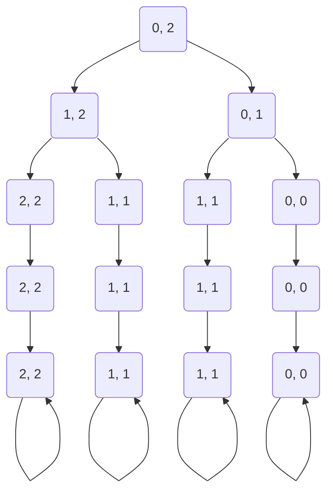

```mermaid
graph TD
    A(0, 2)
    A --> B(1, 2)
    A --> C(0, 1)

    B --> D(2, 2)
    B --> E(1, 1)

    C --> F(1, 1)
    C --> G(0, 0)

    D --> H(2, 2)

    E --> I(1, 1)

    F --> J(1, 1)

    G --> K(0, 0)

    H --> L(2, 2)

    I --> M(1, 1)

    J --> N(1, 1)

    K --> O(0, 0)

    L --> L
    M --> M
    N --> N
    O --> O
```
