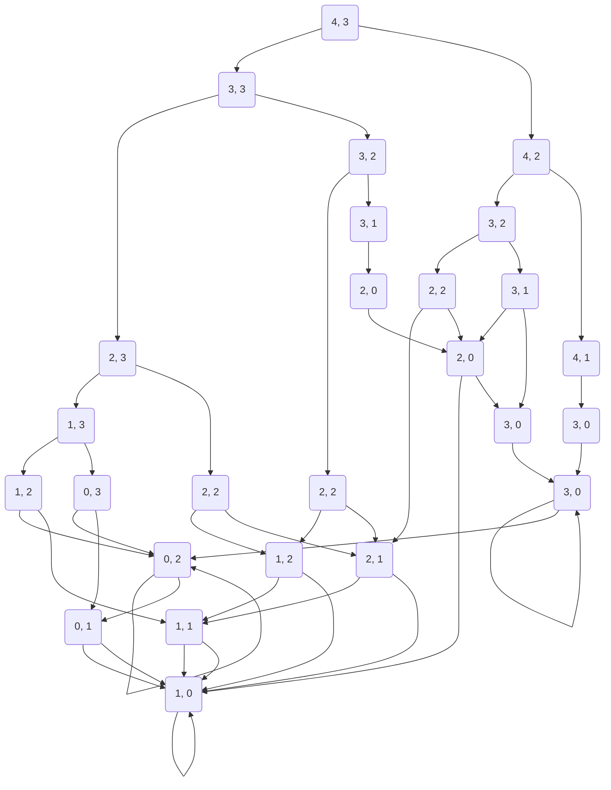

```mermaid
graph TD
    A(4, 3)
    A --> B(3, 3)
    A --> C(4, 2)

    B --> D(2, 3)
    B --> E(3, 2)

    C --> F(3, 2)
    C --> G(4, 1)

    D --> H(1, 3)
    D --> I(2, 2)

    E --> J(2, 2)
    E --> K(3, 1)

    F --> L(2, 2)
    F --> M(3, 1)

    G --> N(3, 0)

    H --> O(1, 2)
    H --> P(0, 3)

    I --> Q(1, 2)
    I --> R(2, 1)

    J --> Q
    J --> R

    K --> S(2, 0)

    L --> R
    L --> T(2, 1)

    M --> T
    M --> U(3, 0)

    N --> V(3, 0)

    O --> W(0, 2)
    O --> X(1, 1)

    P --> W
    P --> Y(0, 1)

    Q --> X
    Q --> Z(1, 0)

    R --> X
    R --> Z

    S --> T(2, 0)

    T --> Z
    T --> U

    U --> V

    V --> V
    V --> W

    W --> W
    W --> Y

    X --> Z
    X --> Z

    Y --> Z
    Y --> Z

    Z --> Z
    Z --> Z
```
